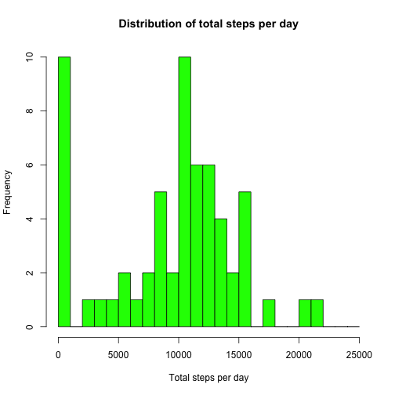
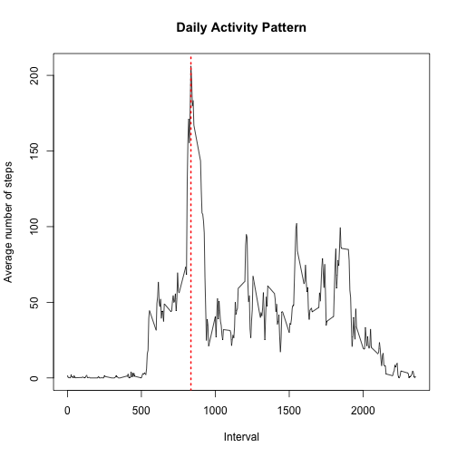
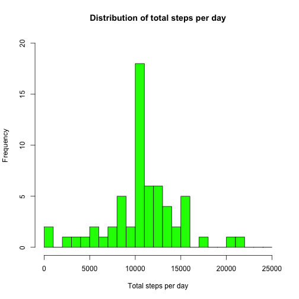
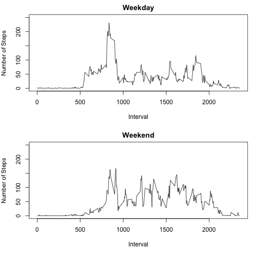

---
title: "Reproducible Research: Peer Assessment 1"  
author: "Kalai Selvan"  
date: "February 15, 2015"  
output: html_document  
keep_md: true  

---

  
## Loading and preprocessing the data

Loading the activity monitoring data using the read.csv command ("activity.csv" file should exist in the current working directory.).....


```r
activityData <- read.csv("activity.csv")
```
  
Load the plyr library

```r
library(plyr)
```

## What is mean total number of steps taken per day?

1. The following code chunk calculates the total number of steps taken for each day and assigns the result to the stepsPerDay dataframe

```r
stepsPerDay <- ddply(activityData, .(date), summarize, totalSteps = sum(steps, na.rm = TRUE))
```

2. The following is a histogram of total steps taken per day

```r
bins <- seq(0, 25000, by = 1000)
hist(stepsPerDay$totalSteps, breaks=bins, main = "Distribution of total steps per day", col = "green", xlab = "Total steps per day")
```

 

3. The following code chunk calculates the mean and median of the total number of steps taken per day

```r
meanSteps <- round(mean(stepsPerDay$totalSteps),digits = 2)
medianSteps <- round(median(stepsPerDay$totalSteps), digits = 2)
```

Mean of total number of steps taken per day is: 9354.23

Median of total number of steps taken per day is: 1.0395 &times; 10<sup>4</sup>

## What is the average daily activity pattern?

1. The following code chunk calculates the average steps taken for each 5 minute interval, averged across all days.

```r
avgDailyActivity <- ddply(activityData, .(interval), summarize, avgSteps = mean(steps, na.rm = TRUE))
```

2. The following code chunk calculates the 5-minute interval, on average across all the days in the dataset, that contains the maximum number of steps.

```r
intWithMaxAvgSteps <- subset(avgDailyActivity, avgSteps == max(avgSteps))[[1]]
```

Time series plot of the 5-minute interval (x-axis) and the average number of steps taken, averaged across all days (y-axis)

```r
with(avgDailyActivity, plot(interval,avgSteps, type="l", xlab="Interval", ylab="Average number of steps", main="Daily Activity Pattern"))
abline(v=intWithMaxAvgSteps, col=2, lty=3, lwd=2)
```

 

The 5-minute interval, on average across all the days in the dataset, that contains the maximum number of steps is: 835

## Imputing missing values

1. The following code chunk calculates the number of rows in the datset that have missing values (coded as NA)

```r
missingValueCount <- length(which(is.na(activityData)))
```
Number of missing values in the dataset is: 2304

2. Strategy for filling in all of the missing values: Assign the mean for the 5-minute interval (averaged across all days), if its value is NA 

3. The following code chunk creates a new dataset that is equal to the original dataset and assigns the mean for the 5-minute interval (averaged across all days), if its value is NA

```r
activityData2 <- activityData
activityData2$steps <- ifelse(is.na(activityData2$steps), avgDailyActivity$avgSteps[match(activityData2$interval,avgDailyActivity$interval)], activityData2$steps)
```

The following code chunk creates a dataframe with the date and the total steps taken each day

```r
stepsPerDay2 <- ddply(activityData2, .(date), summarize, totalSteps = sum(steps))
```

4. The following is a histogram of total steps taken each day

```r
bins <- seq(0, 25000, by = 1000)
hist(stepsPerDay2$totalSteps, breaks=bins, main = "Distribution of total steps per day", col = "green", xlab = "Total steps per day", ylim=c(0,20))
```

 

The following code chunk calculates the mean and median of the total number of steps taken per day

```r
meanSteps2 <- round(mean(stepsPerDay2$totalSteps), digits=2)
medianSteps2 <- round(median(stepsPerDay2$totalSteps), digits=2)
```

Mean of total number of steps taken per day is: 1.076619 &times; 10<sup>4</sup>

Median of total number of steps taken per day is: 1.076619 &times; 10<sup>4</sup>


These mean and median values are higher than the values from the first part of the assignment. 

The frequency of total steps per day between 10000 and 11000 has increased from 10 to 18 in the histogram. Also the frequency of total steps per day between 0 and 1000 has decreased from 10 to 2.

## Are there differences in activity patterns between weekdays and weekends?

1.The following code chunk creates a new factor variable called dayType that contains the values "Weekend" or "Weekeday" for each observation. The values are derived based on the date variable. 

```r
activityData2$dayType <- as.factor(ifelse(weekdays(as.Date(activityData2$date)) %in% c("Saturday","Sunday"), "Weekend", "Weekday"))
```

The following code chunk creates a new datafrome with the average number of steps taken during each 5-minute interval, averaged across all weekday days or weekend days

```r
avgStepsPerIntByDayType <- ddply(activityData2, .(dayType,interval), summarize, avgSteps = mean(steps))
```

2. Time series panel plot of the five minute interval and the average number of steps taken (averaged across weekday days or weekend days)

```r
par(mfcol = c(2,1), mar = c(5, 4, 2, 1))
with(avgStepsPerIntByDayType[avgStepsPerIntByDayType$dayType == "Weekday",], plot(interval, avgSteps, type="l", main="Weekday", xlab="Interval", ylab="Number of Steps", ylim=c(0,250)))
with(avgStepsPerIntByDayType[avgStepsPerIntByDayType$dayType == "Weekend",], plot(interval, avgSteps, type="l", main="Weekend", xlab="Interval", ylab="Number of Steps", ylim=c(0,250)))
```

 
